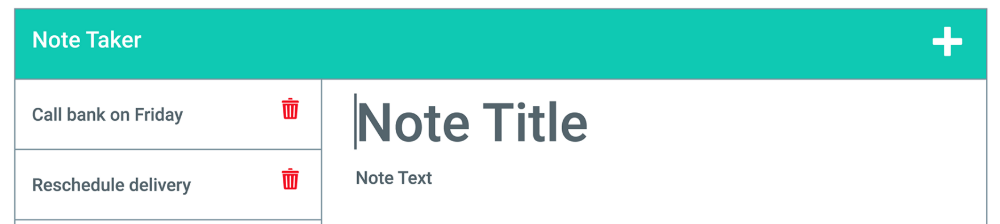

# Note Taker

## Summary  

The project will show a landing page and when you click on get started, you get another page where you can create notes. You can save notes by clicking on save icon at the top, you can also delete notes clicking on delete icon at the left panel where the notes are saved. You can also preview the notes that you have saved by clicking on the save notes in the same left panel. The notes are saved in seprate JSON file. We you express to create API routes to communicated the JSON flie.

## Installation

install Node. After install node type the following
npm init
npm install

## Website

https://hidden-ravine-39028.herokuapp.com/

## Tools used

HTML, CSS, JavaScript, Node, Express, Heroku and msql2.

## Contributors

Zohaib Ali
